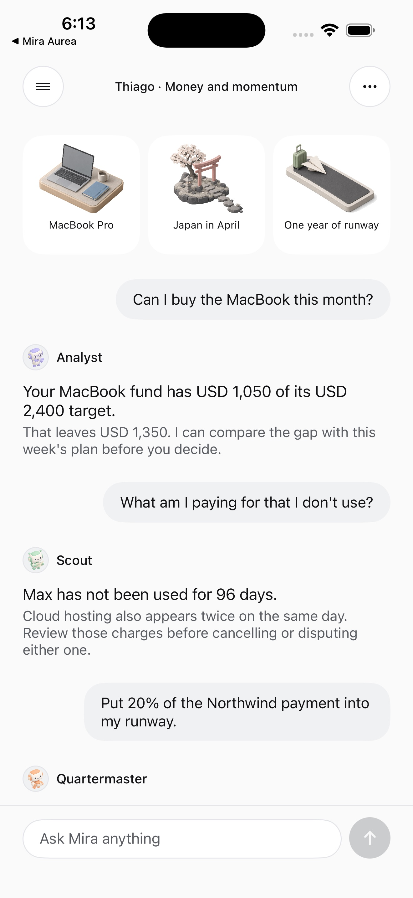
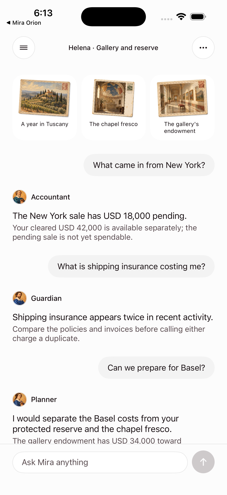

# Mira — Orion & Aurea

Mira is an independent iOS concept for a money assistant. Orion and Aurea share one SwiftUI product core and use distinct visual systems. Six fictional profiles give the prototype realistic financial context, conversations, goals, subscriptions and activity.

Financial actions are simulated. The project does not connect to bank accounts or move real money.

| Orion | Aurea |
| --- | --- |
|  |  |

## What the prototype explores

- A conversational home that routes requests to six named specialists per brand.
- A balanced, multi-currency journal with explicit FX rates and fee treatment.
- Plans, recurring costs, card controls, contacts and illustrated savings goals.
- Review and confirmation before simulated money movements.
- Durable chat threads and profile-specific data.
- Local deterministic answers when a model or network is unavailable.

Choose one of three profiles in each app. **Menu → Profile story** opens that person's guided conversation. **Menu → Switch profile** returns to the chooser, and **Back to chat** returns without changing the current profile.

## Run locally

Requirements: macOS with Xcode 26, an iOS simulator, Node.js 20 or newer.

```sh
cp .env.example .env
npm test
xcodebuild -project MiraApp/Mira.xcodeproj -scheme MiraOrion \
  -destination 'platform=iOS Simulator,name=<your simulator>' build
xcodebuild -project MiraApp/Mira.xcodeproj -scheme MiraAurea \
  -destination 'platform=iOS Simulator,name=<your simulator>' build
```

The proxy is optional for browsing the app and its built-in profile stories. For local proxy development, configure `.env` and run `./scripts/serve.sh`. Credentials stay on the server and are excluded from this repository. `MIRA_UDID=<simulator-udid> ./scripts/install-simulator.sh` builds and installs both brands; without a proxy key, the installed apps use local behavior. Use this installer for a hosted-proxy simulator build: a raw Xcode build does not carry the proxy URL or key, so installing it directly replaces the connected app with a loopback-only one.

## Architecture

`MiraApp/` contains the two iOS targets, shared domain logic, screens, artwork and tests. `server/` contains the Node proxy and its tests. `api/` holds the serverless decision entry point. The assistant's prose does not directly alter the journal: typed actions go through deterministic validation and the relevant confirmation path.

This is a product hypothesis and a working prototype, not a released financial service. The screenshots show fictional accounts and people.
